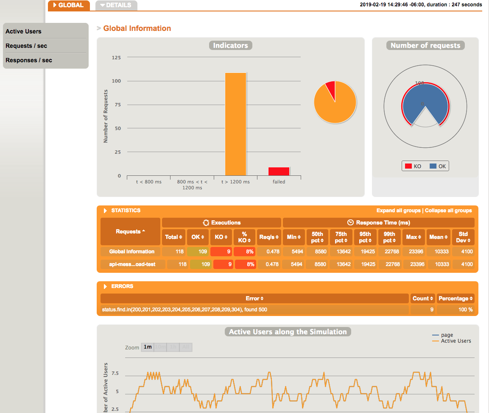

## Table of Contents ##
* [Why Gatling?](#why-gatling)  
* [Gatling Installation](#installation)     
* [Gatling Directory Structure](#directory)  
* [Running your first load test in less than 5 minutes](#first-test) 
* [Load test examples](#test-examples) 
* [Reports](#reports)
* [Contributing](#contributing)
- - - -

<br /><a name="why-gatling"/>

## Why Gatling? ##
* [Gatling](https://gatling.io/) is load testing as code which is ideal for integration with DevOps, Continuous Integration, and [build tools](https://gatling.io/download/).
* Simulate thousands of requests per second against your APIs and applications.
* Identify or troubleshoot performance and load issues.
* Are your APIs and applications [C10k](https://en.wikipedia.org/wiki/C10k_problem) compliant? Determine how many concurrent users your infrastructure, APIs, and website can handle.
* Automatically generates an exhaustive, dynamic, and colorful report with high-precision metrics.
* Test your public APIs and applications against [Denial of Service](https://en.wikipedia.org/wiki/Denial-of-service_attack) attacks.


<br /><a name="installation"/>

## Gatling Installation ##
Gatling has several [installation options](https://gatling.io/docs/current/installation/):  
* [Download Gatling's bundle](https://gatling.io/docs/current/installation/#using-the-bundle) and [run Gatling](https://gatling.io/docs/current/quickstart/#running-gatling) locally as a standalone tool (recommended).
* Install and run Gatling via a [build tool](https://gatling.io/docs/current/installation/#using-a-build-tool).
* Install and run Gatling [using an IDE](https://gatling.io/docs/current/installation/#using-an-ide).


<br /><a name="directory"/>

## Gatling Directory Structure ##
Source code directory:
* $GATLING_HOME/user-files/simulations (directory for your Scala load tests)
* $GATLING_HOME/user-files/resources (directory for your users.csv file if you need a load test with multiple unique authenticated users)


<br /><a name="first-test"/>

## Running your first load test in less than 5 minutes ##
1. Copy/Merge the _user-files_ directory from this repo to your local _$GATLING_HOME_ directory. The _$GATLING_HOME_ directory will be your Gatling download directory. Refer to the _user-files/simulations/healthpartners_ directory for tests.
2. [Run Gatling](https://gatling.io/docs/current/quickstart/#running-gatling) locally as a standalone application by running the following command: 
	* On Linux/Unix: _$GATLING_HOME/bin/gatling.sh_
	* On Windows: _%GATLING_HOME%\bin\gatling.bat_
	Gatling will prompt a few questions: 
		* Which test to run? Choose any "healthpartners" test.
		* Enter an optional test description? Hit enter to skip.
		* When the simulation is done, the console will display a link to the HTML reports.


<br /><a name="test-examples"/>

## Load Test Examples ##
Refer to the _user-files/simulations_ directory for test examples. We have a few authenticated and unauthenticated load tests for REST APIs and our website. The authenticated tests refer to user data (users.csv) in _user-files/resources_. The Gatling installation also has several load tests for Web applications (refer to tests in $GATLING_HOME/user-files/simulations/computerdatabase).
* [REST API load test (authenticated)](./user-files/simulations/api/api-itunes-authenticated-test.scala)
* [Web login load test (authenticated)](./user-files/simulations/web/web-twitter-authenticated-test.scala)

```java
class ItunesApiAuthenticatedLoadTest extends Simulation {
    private val loadTestName = "api-itunes-load-test"
    private val repeatTimes = 1    // How often to repeat the test scenario per user
    private val httpProtocol = http.baseUrl("https://itunes.apple.com")  
    private val users = csv("users.csv") 
    private val loadTestAPI = repeat(repeatTimes, "n") {
        exec(http(loadTestName)
            .get("/search?term=michael+jackson&limit=25")
            .basicAuth("${username}", "${password}")
        )
    }
    private val scn = scenario("page")
        .feed(users)
        .exec(loadTestAPI)

    // Run the load test with your preferred load (rampUsers & repeatTimes) within your preferred duration (seconds)
    setUp(scn.inject(rampUsers(10) during (10 seconds))).protocols(httpProtocol)
}
```


<br /><a name="reports"/>

## Reports ##
Load test reports are automatically generated in _$GATLING_HOME/results_ when your load test completes. Refer to the console when your test finishes for the full path. Gatling creates beautiful charts!




<br />

## Technologies ##
Load tests are created with:
* Scala


<br /><a name="contributing"/>

## Contributing ##
Feel free to commit your load tests to this repo.
* The _user-files_ directory is Gatling's source directory for load tests and resource files: _$GATLING_HOME/user-files_. 
* Load tests are in the 'user-files/simulations' directory 
* User data (users.csv) is in the 'user-files/resources' directory.